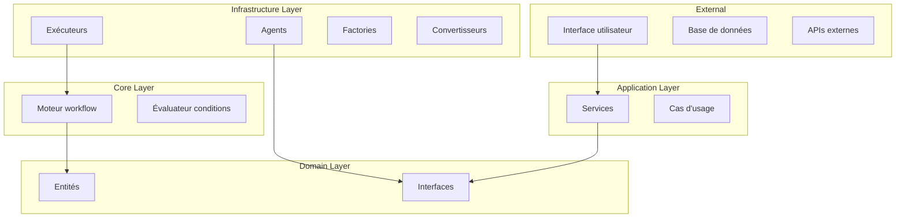
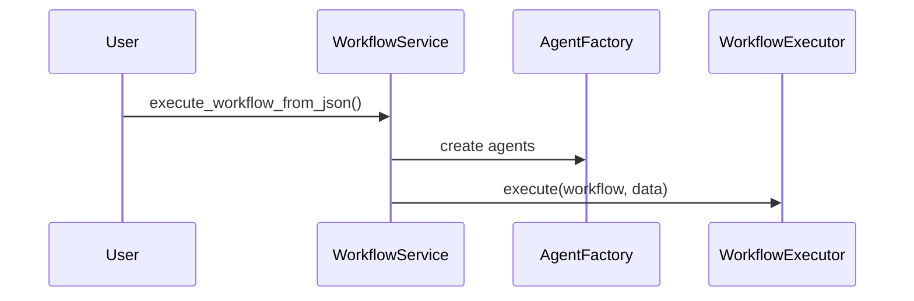
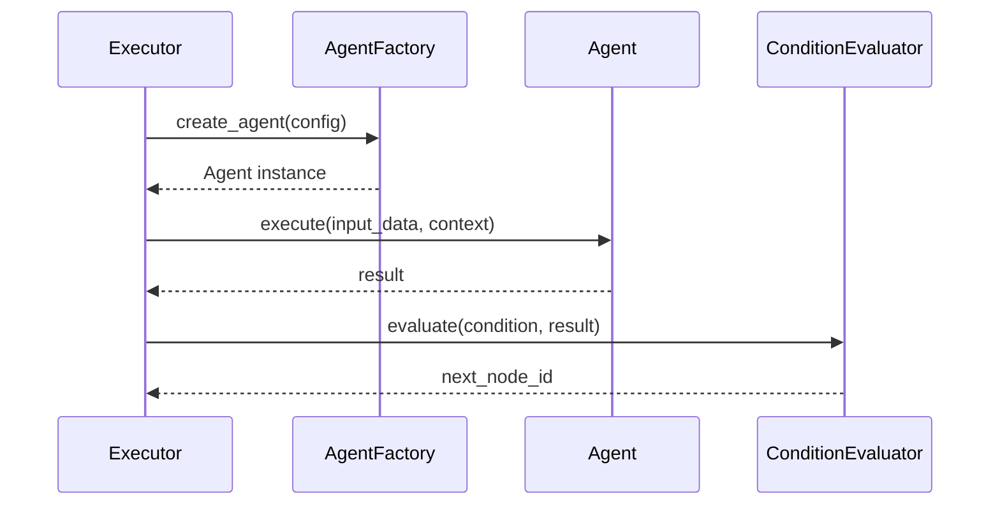
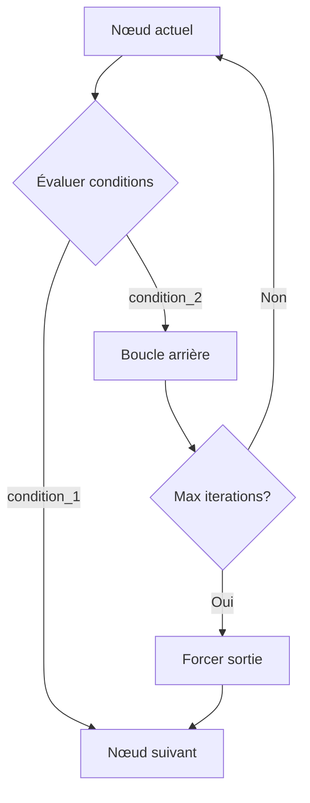

# Vue d'ensemble de l'architecture

Dynamic Agent Workflows est conçu selon les principes de la **Clean Architecture** (Architecture Hexagonale) pour garantir la maintenabilité, l'extensibilité et la testabilité.

## Principes de conception

### SOLID
- **S**ingle Responsibility : Chaque classe a une responsabilité unique
- **O**pen/Closed : Ouvert à l'extension, fermé à la modification
- **L**iskov Substitution : Les implémentations respectent leurs contrats
- **I**nterface Segregation : Interfaces spécifiques et focalisées
- **D**ependency Inversion : Dépendance aux abstractions, pas aux implémentations

### Clean Architecture


## Structure des dossiers

```
src/
├── domain/                 # 🏛️ Couche Domaine (Règles métier)
│   ├── entities/          # Entités métier (WorkflowDefinition, Node, Edge)
│   └── interfaces/        # Contrats d'interface (IAgent, IExecutor)
│
├── application/           # 🎯 Couche Application (Cas d'usage)
│   └── services/         # Services orchestrant la logique métier
│
├── infrastructure/        # 🔧 Couche Infrastructure (Implémentations)
│   ├── agents/           # Implémentations concrètes d'agents
│   ├── executors/        # Exécuteurs de workflows
│   ├── factories/        # Création d'objets
│   └── converters/       # Conversion de formats
│
├── core/                 # ⚙️ Couche Noyau (Logique centrale)
│   ├── condition_evaluator.py
│   └── workflow_engine.py
│
└── blueprints/           # 📋 Définitions de workflows
    └── workflow_definitions.py
```

## Couches détaillées

### Domain Layer (Couche Domaine)

**Responsabilité** : Définir les règles métier et les contrats

#### Entités (`entities/`)

```python
# workflow_definition.py
class WorkflowDefinition(BaseModel):
    name: str
    description: str
    start_node: str
    nodes: List[WorkflowNode]
    edges: List[WorkflowEdge]

# workflow_node.py  
class WorkflowNode(BaseModel):
    id: str
    name: str
    type: NodeType
    max_iterations: Optional[int]
    agent_config: Dict[str, Any]

# workflow_edge.py
class WorkflowEdge(BaseModel):
    from_node: str
    to_node: str
    condition: Optional[str]
```

#### Interfaces (`interfaces/`)

```python
# i_agent.py
class IAgent(ABC):
    @abstractmethod
    async def execute(self, input_data: Any, context: Dict[str, Any]) -> Any:
        pass

# i_workflow_executor.py
class IWorkflowExecutor(ABC):
    @abstractmethod
    async def execute(self, workflow: WorkflowDefinition, initial_data: Any) -> Dict[str, Any]:
        pass
```

### Application Layer (Couche Application)

**Responsabilité** : Orchestrer les cas d'usage métier

```python
# services/workflow_service.py
class WorkflowService:
    def __init__(self):
        self.agent_factory = AgentFactory()
        self.executor = WorkflowExecutor(self.agent_factory)
    
    async def execute_workflow_from_json(self, json_def: Dict, initial_data: Any):
        workflow = self._convert_json_to_workflow(json_def)
        return await self.executor.execute(workflow, initial_data)
```

### Infrastructure Layer (Couche Infrastructure)

**Responsabilité** : Implémentations concrètes des interfaces

#### Agents (`agents/`)

```python
# pydantic_agent.py
class PydanticAgent(IAgent):
    def __init__(self, config: Dict[str, Any]):
        self.agent = Agent(
            model=config.get("model"),
            system_prompt=config.get("system_prompt")
        )
    
    async def execute(self, input_data: Any, context: Dict[str, Any]) -> Any:
        result = await self.agent.run(input_data)
        return self._parse_response(result)
```

#### Exécuteurs (`executors/`)

```python
# workflow_executor.py
class WorkflowExecutor(IWorkflowExecutor):
    async def execute(self, workflow: WorkflowDefinition, initial_data: Any):
        current_node_id = workflow.start_node
        
        while current_node_id:
            node = self._find_node(workflow, current_node_id)
            result = await self._execute_node(node, current_data)
            next_node_id = self._determine_next_node(workflow, current_node_id, result)
            current_node_id = next_node_id
```

### Core Layer (Couche Noyau)

**Responsabilité** : Logique métier centrale partagée

```python
# condition_evaluator.py
class ConditionEvaluator:
    @staticmethod
    def evaluate(condition: str, result: Any, context: Dict) -> bool:
        # Logique d'évaluation des conditions génériques
        if condition in result:
            return result[condition] is True
        
        # Conditions négatives
        if condition in NEGATIVE_MAPPINGS:
            positive = NEGATIVE_MAPPINGS[condition]
            return result.get(positive, False) is False
```

## Flux d'exécution

### 1. Initialisation



### 2. Exécution d'un nœud



### 3. Gestion des boucles



## Patterns utilisés

### Factory Pattern

```python
class AgentFactory(IAgentFactory):
    def create_agent(self, config: Dict[str, Any]) -> IAgent:
        agent_type = config.get("type", "pydantic")
        
        if agent_type == "pydantic":
            return PydanticAgent(config)
        elif agent_type == "custom":
            return CustomAgent(config)
        else:
            raise ValueError(f"Unknown agent type: {agent_type}")
```

### Strategy Pattern

```python
class ConditionEvaluator:
    def __init__(self):
        self.strategies = {
            "simple": SimpleConditionStrategy(),
            "complex": ComplexConditionStrategy(),
            "temporal": TemporalConditionStrategy()
        }
    
    def evaluate(self, condition: str, result: Any) -> bool:
        strategy = self._get_strategy(condition)
        return strategy.evaluate(condition, result)
```

### Observer Pattern

```python
class WorkflowExecutor:
    def __init__(self):
        self.observers: List[IWorkflowObserver] = []
    
    def add_observer(self, observer: IWorkflowObserver):
        self.observers.append(observer)
    
    def _notify_node_executed(self, node_id: str, result: Any):
        for observer in self.observers:
            observer.on_node_executed(node_id, result)
```

## Extensibilité

### Ajouter un nouveau type d'agent

1. **Créer l'implémentation**
```python
class LangChainAgent(IAgent):
    async def execute(self, input_data: Any, context: Dict[str, Any]) -> Any:
        # Implémentation avec LangChain
        pass
```

2. **Enregistrer dans la factory**
```python
class AgentFactory:
    def create_agent(self, config: Dict[str, Any]) -> IAgent:
        if config["type"] == "langchain":
            return LangChainAgent(config)
```

### Ajouter un nouveau type de condition

```python
class ConditionEvaluator:
    def _evaluate_special_conditions(self, condition: str, result: Dict, context: Dict) -> bool:
        if condition.startswith("custom_"):
            return self._evaluate_custom_condition(condition, result, context)
```

### Ajouter un observateur

```python
class MetricsObserver(IWorkflowObserver):
    def on_node_executed(self, node_id: str, result: Any):
        self.metrics.record_execution(node_id, len(str(result)))
    
    def on_workflow_completed(self, workflow_id: str, duration: float):
        self.metrics.record_completion(workflow_id, duration)
```

## Tests et qualité

### Architecture testable

```python
# Test d'intégration
class TestWorkflowExecution:
    def test_writer_reviewer_workflow(self):
        # Given
        mock_agent_factory = Mock()
        executor = WorkflowExecutor(mock_agent_factory)
        
        # When
        result = await executor.execute(workflow, input_data)
        
        # Then
        assert result["final_result"] is not None
```

### Isolation des dépendances

```python
# Test unitaire
class TestConditionEvaluator:
    def test_boolean_condition(self):
        # Given
        evaluator = ConditionEvaluator()
        result = {"approved": True}
        
        # When
        is_approved = evaluator.evaluate("approved", result, {})
        
        # Then
        assert is_approved is True
```

## Performance et optimisation

### Points d'attention

1. **Création d'agents** : Cache des instances
2. **Parsing JSON** : Validation en amont
3. **Historique** : Limite de taille en mémoire
4. **Boucles infinies** : Timeout global

### Métriques importantes

```python
class WorkflowMetrics:
    def __init__(self):
        self.execution_times = {}
        self.node_call_counts = {}
        self.error_rates = {}
    
    def record_node_execution(self, node_id: str, duration: float):
        self.execution_times[node_id] = duration
```

## Sécurité

### Isolation des exécutions

- Chaque workflow s'exécute dans son propre contexte
- Pas de partage d'état entre workflows
- Limitation des itérations pour éviter les DoS

### Validation des entrées

```python
def validate_workflow_definition(workflow: Dict) -> List[str]:
    errors = []
    
    if "start_node" not in workflow:
        errors.append("Missing start_node")
    
    node_ids = {node["id"] for node in workflow.get("nodes", [])}
    if workflow.get("start_node") not in node_ids:
        errors.append("start_node not found in nodes")
    
    return errors
```

## Prochaines étapes

- 🔧 [Composants détaillés](components.md) - Architecture de chaque composant
- 🚀 [Extension du framework](extending.md) - Guide pour ajouter des fonctionnalités
- 📊 [API Reference](../api/interfaces.md) - Documentation technique complète
