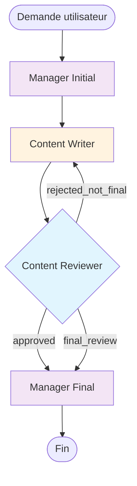

# Workflow Writer-Reviewer

Ce workflow illustre un processus de création de contenu avec révision automatisée et boucles de feedback.

## Vue d'ensemble

Le workflow Writer-Reviewer simule un processus éditorial où :

1. **Un manager** reformule la demande utilisateur
2. **Un rédacteur** crée le contenu
3. **Un réviseur** évalue et donne du feedback
4. **Le cycle se répète** jusqu'à approbation (max 3 fois)
5. **Le manager** présente le résultat final

## Schéma du workflow



## Configuration JSON

```json
{
  "name": "Writer-Reviewer Workflow",
  "description": "Workflow de création de contenu avec révision",
  "start_node": "manager_initial",
  "nodes": [
    {
      "id": "manager_initial",
      "name": "Manager Initial",
      "type": "process",
      "agent_config": {
        "type": "pydantic",
        "model": "openai:gpt-4o-mini",
        "name": "Manager",
        "system_prompt": "You are a project manager. Transform user requests into clear writing instructions including topic, length, format, audience, and tone."
      }
    },
    {
      "id": "writer",
      "name": "Content Writer",
      "type": "process",
      "max_iterations": 3,
      "agent_config": {
        "type": "pydantic",
        "model": "openai:gpt-4o-mini",
        "name": "Writer",
        "system_prompt": "You are a professional content writer. Create high-quality content based on instructions. If you receive feedback, incorporate it while staying true to original requirements."
      }
    },
    {
      "id": "reviewer",
      "name": "Content Reviewer",
      "type": "decision",
      "max_iterations": 3,
      "agent_config": {
        "type": "pydantic",
        "model": "openai:gpt-4o-mini",
        "name": "Reviewer",
        "node_type": "decision",
        "system_prompt": "Review content and return JSON: {\"approved\": true/false, \"feedback\": \"detailed feedback\", \"final_review\": false}. Approve only if content fully meets requirements."
      }
    },
    {
      "id": "manager_final",
      "name": "Manager Final",
      "type": "process",
      "agent_config": {
        "type": "pydantic",
        "model": "openai:gpt-4o-mini",
        "name": "Manager",
        "system_prompt": "Present final results to user. If approved, showcase the content. If rejected after max iterations, explain situation and provide summary."
      }
    },
    {
      "id": "end",
      "name": "End",
      "type": "end",
      "agent_config": {}
    }
  ],
  "edges": [
    {"from_node": "manager_initial", "to_node": "writer"},
    {"from_node": "writer", "to_node": "reviewer"},
    {"from_node": "reviewer", "to_node": "writer", "condition": "rejected_not_final"},
    {"from_node": "reviewer", "to_node": "manager_final", "condition": "approved"},
    {"from_node": "reviewer", "to_node": "manager_final", "condition": "final_review"},
    {"from_node": "manager_final", "to_node": "end"}
  ]
}
```

## Exécution étape par étape

### 1. Données initiales

```python
input_data = {
    "topic": "Intelligence artificielle dans les PME",
    "length": "200 mots",
    "format": "article de blog",
    "audience": "dirigeants de PME",
    "tone": "professionnel mais accessible"
}
```

### 2. Manager Initial → Instructions détaillées

**Entrée** : Demande utilisateur
```json
{
  "topic": "Intelligence artificielle dans les PME",
  "length": "200 mots",
  "format": "article de blog",
  "audience": "dirigeants de PME"
}
```

**Sortie** : Instructions pour le rédacteur
```text
"Rédigez un article de blog de 200 mots sur l'intelligence artificielle dans les PME. 
Le public cible est constitué de dirigeants d'entreprise. Adoptez un ton professionnel 
mais accessible. Incluez des exemples concrets et des bénéfices pratiques."
```

### 3. Content Writer → Premier article

**Entrée** : Instructions du manager

**Sortie** : Article initial
```text
"L'Intelligence Artificielle : Un Atout pour les PME

L'intelligence artificielle n'est plus réservée aux grandes entreprises. 
Aujourd'hui, les PME peuvent exploiter cette technologie pour automatiser 
leurs processus et améliorer leur efficacité.

Les applications pratiques incluent la gestion automatisée des emails, 
l'analyse prédictive des ventes, et l'optimisation des stocks..."
```

### 4. Content Reviewer → Évaluation

**Entrée** : Article du rédacteur

**Sortie** : Évaluation JSON
```json
{
  "approved": false,
  "feedback": "L'article est bien structuré mais manque d'exemples concrets d'entreprises PME. Ajoutez 1-2 cas d'usage spécifiques et mentionnez les coûts approximatifs.",
  "final_review": false
}
```

### 5. Content Writer → Article amélioré (Itération 2)

**Entrée** : Feedback du réviseur

**Sortie** : Article révisé
```text
"L'Intelligence Artificielle : Un Atout pour les PME

L'intelligence artificielle n'est plus réservée aux grandes entreprises. 
Marie, dirigeante d'une PME de 15 employés, a implémenté un chatbot 
pour 200€/mois qui traite 80% des demandes client automatiquement.

Les solutions accessibles incluent :
- Gestion emails automatisée (50€/mois)
- Analyse prédictive des ventes (150€/mois)
- Optimisation des stocks via IA

ROI moyen constaté : 15-30% d'économies opérationnelles dès la première année."
```

### 6. Content Reviewer → Approbation

**Entrée** : Article révisé

**Sortie** : Approbation
```json
{
  "approved": true,
  "feedback": "Excellent article ! Les exemples concrets et les prix rendent l'IA accessible. Le cas d'usage de Marie est parfait pour l'audience cible.",
  "final_review": false
}
```

### 7. Manager Final → Présentation finale

**Entrée** : Contexte enrichi
```json
{
  "content": {"approved": true, "feedback": "..."},
  "original_request": {...},
  "iterations": {"writer": 2, "reviewer": 2},
  "history": [...]
}
```

**Sortie** : Présentation finale
```text
"Voici votre article de blog approuvé sur l'IA dans les PME :

[Article complet avec exemples concrets]

L'article a été validé après 2 itérations avec des retours très positifs 
du réviseur qui souligne la pertinence des exemples et des prix mentionnés."
```

## Conditions et transitions

### Logique du réviseur

```python
# Condition: rejected_not_final
if not approved and not final_review and current_iteration < 3:
    return "writer"  # Boucle de feedback

# Condition: approved  
if approved:
    return "manager_final"  # Succès

# Condition: final_review
if final_review or current_iteration >= 3:
    return "manager_final"  # Limite atteinte
```

### Gestion des itérations

- **Writer** : Maximum 3 itérations
- **Reviewer** : Maximum 3 itérations
- **Auto-finalisation** : Si limite atteinte, passage forcé au manager final

## Exécution en pratique

### Commande simple

```bash
python main.py --writer
```

### Avec détails

```bash
python main.py --writer --detailed
```

### Sortie attendue

```
=== Writer-Reviewer Workflow ===
🔄 Manager Initial - Iteration 1
   ➡️ Manager Initial → Content Writer
🔄 Content Writer - Iteration 1
   ➡️ Content Writer → Content Reviewer
🔄 Content Reviewer - Iteration 1
   ➡️ Content Reviewer → Content Writer
🔄 Content Writer - Iteration 2
   ➡️ Content Writer → Content Reviewer
🔄 Content Reviewer - Iteration 2
   ➡️ Content Reviewer → Manager Final
🔄 Manager Final - Iteration 1
   ➡️ Manager Final → End
🔄 End - Iteration 1
   ✅ Workflow terminé

🏁 Résultat final:
   Voici votre article de blog approuvé...

📊 Statistiques:
   • Itérations par nœud: {'manager_initial': 1, 'writer': 2, 'reviewer': 2, 'manager_final': 1, 'end': 1}
   • Total d'itérations: 7
   • Étapes d'exécution: 7
```

## Cas d'usage

### Marketing et communication
- Articles de blog
- Posts réseaux sociaux
- Newsletters
- Communiqués de presse

### Documentation technique
- Guides utilisateur
- Documentation API
- Tutoriels
- FAQ

### Contenu éducatif
- Cours en ligne
- Supports de formation
- Webinaires
- Livres blancs

## Personnalisations possibles

### Modifier les critères de révision

```json
{
  "system_prompt": "Review for: clarity (40%), accuracy (30%), engagement (20%), SEO (10%). Minimum score: 75/100 to approve."
}
```

### Ajouter des rôles spécialisés

```json
{
  "nodes": [
    {"id": "seo_optimizer", "name": "SEO Specialist"},
    {"id": "fact_checker", "name": "Fact Checker"},
    {"id": "legal_reviewer", "name": "Legal Reviewer"}
  ]
}
```

### Conditions personnalisées

```json
{
  "edges": [
    {"from_node": "reviewer", "to_node": "seo_optimizer", "condition": "approved_content"},
    {"from_node": "reviewer", "to_node": "writer", "condition": "needs_revision"},
    {"from_node": "reviewer", "to_node": "legal_reviewer", "condition": "legal_check_needed"}
  ]
}
```

## Dépannage

### Problème : Boucle infinie
**Cause** : Reviewer n'approuve jamais
**Solution** : Vérifier `max_iterations` et `final_review`

### Problème : Parsing JSON échoué
**Cause** : Reviewer retourne du texte au lieu de JSON
**Solution** : Améliorer le prompt avec exemples

### Problème : Qualité insuffisante
**Cause** : Instructions trop vagues
**Solution** : Détailler les critères de qualité dans les prompts

## Prochaines étapes

- 📋 [Processus de recrutement](hiring-process.md) - Workflow avec branchements multiples
- 🔧 [Développement logiciel](development.md) - Workflow avec tests et debugging
- 🏗️ [Architecture](../architecture/overview.md) - Comprendre le fonctionnement interne
