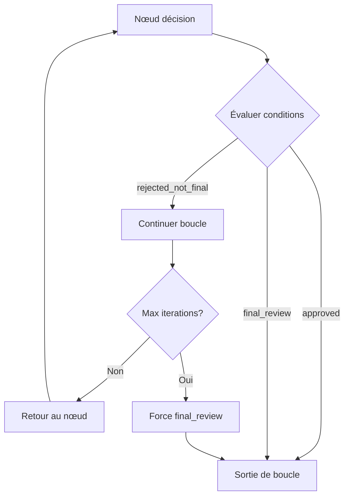

# Conditions et transitions

Ce guide explique comment définir des conditions pour contrôler les transitions entre nœuds dans vos workflows.

## Vue d'ensemble

Les conditions déterminent quel nœud sera exécuté ensuite en fonction du résultat du nœud actuel. Le système d'évaluation des conditions est **générique et extensible**.

## Types de conditions

### 1. Conditions booléennes simples

Évaluent directement une propriété booléenne dans le résultat :

```json
{
  "edges": [
    {"from_node": "reviewer", "to_node": "approved_path", "condition": "approved"},
    {"from_node": "interview", "to_node": "next_step", "condition": "passed"},
    {"from_node": "validator", "to_node": "success", "condition": "valid"}
  ]
}
```

**Fonctionnement** : Cherche `result["approved"]` et vérifie si la valeur est `true`.

### 2. Conditions négatives

Évaluent l'inverse d'une condition positive :

```json
{
  "edges": [
    {"from_node": "reviewer", "to_node": "revision_needed", "condition": "rejected"},
    {"from_node": "interview", "to_node": "candidate_pool", "condition": "failed"},
    {"from_node": "development", "to_node": "continue_dev", "condition": "incomplete"}
  ]
}
```

**Mappings automatiques** :
- `rejected` ↔ `!approved`
- `failed` ↔ `!passed` 
- `incomplete` ↔ `!complete`
- `not_hired` ↔ `!hired`

### 3. Conditions spéciales

Conditions avec logique métier personnalisée :

```json
{
  "edges": [
    {"from_node": "reviewer", "to_node": "writer", "condition": "rejected_not_final"},
    {"from_node": "reviewer", "to_node": "manager", "condition": "final_review"},
    {"from_node": "tester", "to_node": "developer", "condition": "has_issues"},
    {"from_node": "tester", "to_node": "release", "condition": "no_issues"}
  ]
}
```

#### `rejected_not_final`
```python
# Vérifie si :
# - Le contenu n'est pas approuvé ET
# - Ce n'est pas la révision finale ET  
# - On n'a pas atteint la limite d'itérations
is_approved = result.get("approved", False) or result.get("passed", False)
is_final = result.get("final_review", False) or context.get("force_final_review", False)
return not is_approved and not is_final
```

#### `final_review`
```python
# Force la sortie de boucle si :
# - L'agent indique que c'est final OU
# - Le système force la finalisation (limite atteinte)
return result.get("final_review", False) or context.get("force_final_review", False)
```

#### `has_issues` / `no_issues`
```python
# Vérifie la présence de bugs ou erreurs
has_problems = result.get("has_bugs", False) or result.get("has_errors", False)
return has_problems  # pour has_issues
return not has_problems  # pour no_issues
```

### 4. Conditions par défaut

Une transition sans condition s'exécute toujours :

```json
{
  "edges": [
    {"from_node": "processor", "to_node": "next_step"}  // Pas de condition = toujours
  ]
}
```

## Formats de données attendus

### Agents de décision

Les agents de type `decision` doivent retourner un objet JSON structuré :

```json
{
  "approved": true,           // Décision principale
  "feedback": "Excellent travail !",
  "score": 85,               // Métrique optionnelle
  "final_review": false      // Contrôle de boucle
}
```

### Exemples par domaine

#### Révision de contenu
```json
{
  "approved": false,
  "feedback": "Ajouter plus d'exemples concrets",
  "quality_score": 75,
  "final_review": false
}
```

#### Entretien de recrutement
```json
{
  "passed": true,
  "feedback": "Candidat très qualifié",
  "technical_score": 90,
  "communication_score": 85
}
```

#### Tests logiciels
```json
{
  "has_bugs": true,
  "bug_count": 3,
  "severity": "medium",
  "test_report": "3 bugs mineurs détectés dans le module auth"
}
```

#### Développement
```json
{
  "complete": false,
  "progress": 75,
  "remaining_tasks": ["tests unitaires", "documentation"],
  "estimated_time": "2 heures"
}
```

## Logique d'évaluation

### Ordre de priorité

Le système évalue les transitions dans l'ordre de définition et prend la **première condition satisfaite** :

```json
{
  "edges": [
    {"from_node": "reviewer", "to_node": "approved_path", "condition": "approved"},      // 1er
    {"from_node": "reviewer", "to_node": "revision_path", "condition": "rejected"},     // 2ème  
    {"from_node": "reviewer", "to_node": "default_path"}                                // 3ème (défaut)
  ]
}
```

!!! warning "Ordre important"
    L'ordre des transitions est crucial. Placez les conditions les plus spécifiques en premier.

### Gestion des boucles



### Exemple complet - Writer/Reviewer

```json
{
  "edges": [
    {
      "from_node": "writer", 
      "to_node": "reviewer"
    },
    {
      "from_node": "reviewer", 
      "to_node": "writer", 
      "condition": "rejected_not_final"
    },
    {
      "from_node": "reviewer", 
      "to_node": "manager_final", 
      "condition": "approved"
    },
    {
      "from_node": "reviewer", 
      "to_node": "manager_final", 
      "condition": "final_review"
    }
  ]
}
```

**Scénario 1** : Approbation directe
```
Writer → Reviewer(approved: true) → Manager Final
```

**Scénario 2** : Révision nécessaire
```
Writer → Reviewer(approved: false, final_review: false) → Writer → Reviewer(approved: true) → Manager Final
```

**Scénario 3** : Limite d'itérations
```
Writer → Reviewer(rejected) → Writer → Reviewer(rejected) → Writer → Reviewer(force_final: true) → Manager Final
```

## Conditions personnalisées

### Étendre l'évaluateur

Pour ajouter de nouvelles conditions, modifiez `ConditionEvaluator` :

```python
class ConditionEvaluator:
    def _evaluate_special_conditions(self, condition: str, result: Dict, context: Dict) -> bool:
        # Conditions numériques
        if condition.startswith("score_"):
            threshold = int(condition.split("_")[1])
            return result.get("score", 0) >= threshold
        
        # Conditions temporelles
        if condition == "timeout":
            execution_time = context.get("execution_time", 0)
            return execution_time > result.get("max_duration", 300)
        
        # Conditions basées sur l'historique
        if condition == "too_many_revisions":
            revision_count = context.get("revision_count", 0)
            return revision_count > 5
        
        return False
```

### Utilisation des nouvelles conditions

```json
{
  "edges": [
    {"from_node": "evaluator", "to_node": "excellent_path", "condition": "score_90"},
    {"from_node": "evaluator", "to_node": "good_path", "condition": "score_70"},
    {"from_node": "evaluator", "to_node": "poor_path", "condition": "score_0"},
    {"from_node": "processor", "to_node": "timeout_handler", "condition": "timeout"}
  ]
}
```

## Débogage des conditions

### Logs d'évaluation

Le framework affiche les évaluations de conditions :

```bash
🔍 Évaluation des transitions depuis reviewer
📊 Résultat à évaluer: {"approved": false, "feedback": "..."}
   Condition 'approved' -> manager_final
   ❌ Condition non satisfaite
   Condition 'rejected_not_final' -> writer  
   ✅ Condition satisfaite!
```

### Mode détaillé

```bash
uv run main.py --writer --detailed
```

Affiche le détail de chaque évaluation de condition.

### Cas de problèmes courants

#### Condition jamais satisfaite
```python
# Problème : L'agent retourne un string au lieu d'un objet
result = "Content approved"  # ❌

# Solution : Forcer le format JSON dans le prompt
result = {"approved": true, "feedback": "Content approved"}  # ✅
```

#### Boucle infinie
```python
# Problème : Pas de condition de sortie
{"from_node": "reviewer", "to_node": "writer", "condition": "rejected"}  # ❌

# Solution : Ajouter une limite
{"from_node": "reviewer", "to_node": "writer", "condition": "rejected_not_final"}  # ✅
```

#### Transitions multiples
```python
# Problème : Plusieurs conditions vraies simultanément
[
  {"from_node": "node", "to_node": "path1", "condition": "approved"},
  {"from_node": "node", "to_node": "path2", "condition": "score_80"}  // Si approved ET score >= 80
]

# Solution : Ordre spécifique ou conditions exclusives
[
  {"from_node": "node", "to_node": "excellent", "condition": "approved_high_score"},
  {"from_node": "node", "to_node": "good", "condition": "approved"}
]
```

## Bonnes pratiques

### 1. Nommage explicite

```json
// ✅ Bon - Noms explicites
{"condition": "content_approved_by_reviewer"}
{"condition": "candidate_passed_technical_interview"}

// ❌ Éviter - Noms vagues  
{"condition": "ok"}
{"condition": "next"}
```

### 2. Conditions mutuellement exclusives

```json
// ✅ Bon - Conditions claires
[
  {"condition": "approved"},
  {"condition": "rejected_needs_revision"},
  {"condition": "rejected_final"}
]

// ❌ Éviter - Ambiguïtés
[
  {"condition": "approved"},
  {"condition": "not_approved"},  // Que faire si null ?
]
```

### 3. Documentation des conditions

```json
{
  "metadata": {
    "conditions_doc": {
      "approved": "Content meets all quality criteria",
      "rejected_not_final": "Content needs revision and iterations remaining",
      "final_review": "Maximum iterations reached or explicitly marked final"
    }
  }
}
```

## Prochaines étapes

- 📊 [Échange de données](data-flow.md) - Comment les données circulent
-  [Exemples pratiques](../examples/writer-reviewer.md) - Voir des conditions en action
- 🏗️ [Architecture](../architecture/overview.md) - Comprendre le fonctionnement interne
